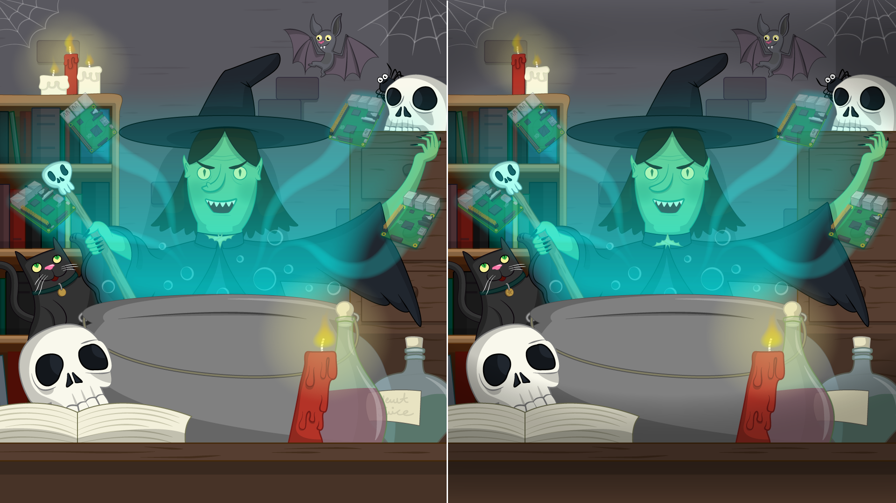

<h2 class="c-project-heading--task">Show the difference image</h2>
### Step 1

Your first step is to display the `spot_the_diff.png` image.

Edit the `draw()` function.

--- code ---
---
language: python
filename: main.py
line_numbers: true
line_number_start: 19
line_highlights: 20
---
def draw():
    image(spot_diff_img, 0, 0, width, height)
--- /code ---

